# Home of wildlife animals - Project portfolio 1 - HTML & CSS
  
Home of wild animals is a small NGO located in Tanzania that presents its work and the people behind it in a warm manner. 
The site is aimed at all individuals who are looking for a professional and reputable organization to help. Visiting the website builds trust by talking in detail about the motivation and daily projects of the organization.

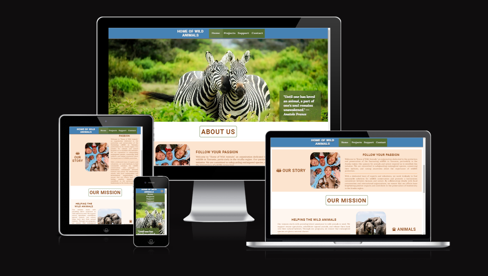

You can explore the live site here - [Link to deployed site](https://chriscross1983.github.io/Home-of-wildlife-animals/)

# Objective

The aim of the website is to introduce the user to a friendly and profesional NGO, with the progressing desire to support the organisation by helping in person or donating.

# UX

## Target Audience

  - User who are looking for volunteering projects
  - User who have an affinity to animals, nature and travel topics 
  - User of any age (maybe limited for volunteering in person) and residing all over the world can activley support

## User Stories

  - A user should be able to determine the site's purpose immediately
  - A user should be able to easily and intuitively navigate the site
  - A user should be able to identify the content of each page easily
  - A user should feel comfortable contacting the business for more information or to book an package

## Site Aims

- To introduce the business to the user in a warm, friendly and inviting manner
- To provide the user with all the information needed to contact the business or to book an package for volunteering
- To offer a alternative but also simple way to support (donation), if the user doesn´t want to volunteer in person
- To offer a clear method to contact the business
- To provide information about the organisation members and their mission
- To supply a short overview of the main projects to work on together 
- To deliver a starting guide to the cost of volunteering

# Design

## Color Scheme
The main idea of building the color scheme was to visualize a warm atmosphere that fits the African culture. For the navigation bar the choise comes to a cool, calming shade of blue that conveys a feeling of confidence and stability. The main text is represented by an earthy tone of African savannahs and landscapes. The sections in the body are seperated by a smooth white line and the used color creates a welcoming and calming atmosphere. The footer symbolized by and green hue symbolizes the vegetation of african bush and dschungles. To ensure good contrast and accessibility, some text areas are written in white. This choice was made because the main color scheme does not have combinations that pass the contrast test.

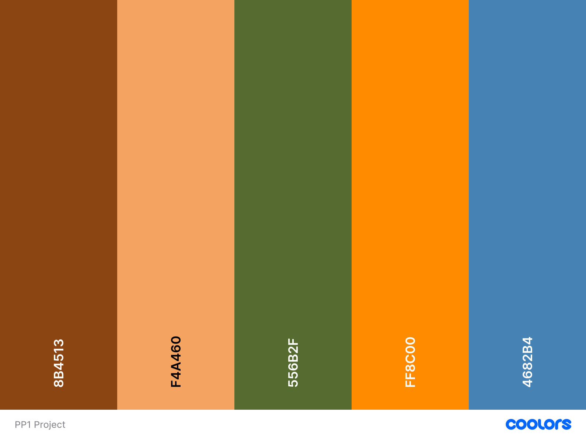

## Typography

Two types of fonts were chosen for this website: "Roboto" and "Lora". The choice of these fonts enhances both readability and aesthetic appel. Roboto, with his clean and modern design, was used for the headings and action buttons. Lora adds a touch of classic refinement to the body text and the menu bar. For better readability and depth, the logo, menu bar and contact form are highlighted by a text shadow. Togehter, these fonts create a harmonious balance between modernity and tradition, perfectly complementing the warm and natural color scheme oft the website.

## Wireframes

The design and structure for this website was created with balsamiq. The designs produced were low fidelity wireframes for desktop, tablet and mobile version. The final designs and structure differ from the wireframes due to developments during the construction of the website.

 Low Fidelity Wireframes 

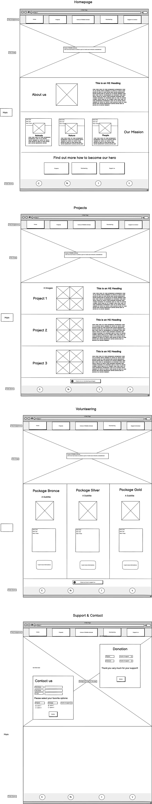

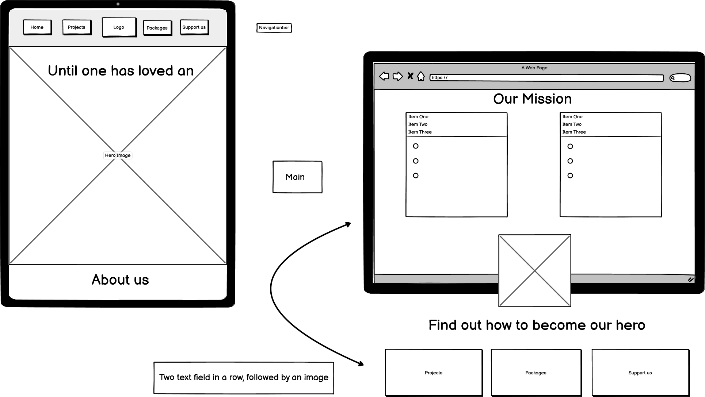

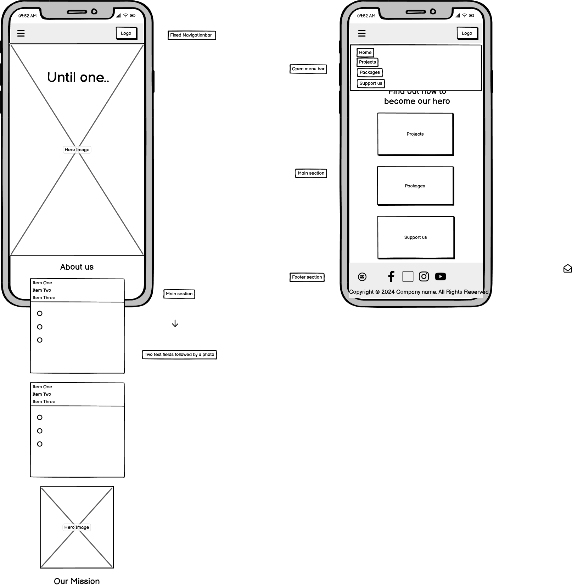

## Site Structure

Home of wild animals consists of 5 page website with 4 pages that the user can navigate between via the navigation bar. The  page is the default loading page. The Logo is on the left side and is also linked to the Home Page. On the right hand site of the logo are four navigation links of [Home](index.html), [Projects](projects.html), [Support](support.html) and [Contact](contact.html). The only hidden page is the ["Thank You" page](thankyou.html), which appears when the user completes and submits the form on the contact page. Until the screen size of 768px the user can navigate through a burger icon, which hides the navigation links for better vibility. When clicked, the menu bar it opens straight down to the bottom of the logo and shows the available options to choose from.

## Imagery used

or under the Acknowlegment section

## Anything else you want to add that relates to UX/UI

# Features

## Navigation

* The navigation menu is featured at the top of the page and contains the links to main content.

* The logo is on the left in the navigation bar and is clickable and links back to the homepage.

* There are four variations of the navigation bar for different screen sizes.

* For a good user experience the design and color style of the menu bar are simple and consistent.

* The current page where the user is located is visualized with a static brighter hue. Additionally, for a better user experience, the brightness of the menu link changes when hovered over, providing a clear indication ot the actionable item.

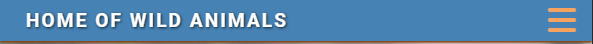

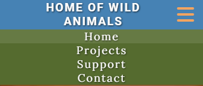

## Home Page

## Projects Page

## Support Page

## Contact Page

## Thank you Page

## Footer

# Future Features

# Technologies Used

* HTML5 - Delivers the structure and content for the website.
* CSS3 - Provides the styling for the website.
* Balsamiq - Used to create wireframes for the website
* Gitpod - Used to develop the website.
* GitBash - Terminal used to push changes to the GitHub repository.
* Github - Used to host and deploy the website.

# Deployment

## Project Deployment via GitHub
  
The Home of wildlife animals repository is stored on GitHub. The site was created using GitPod and the live site is hosted on GitHub Pages. This is a guide to deploy a site on GitHub Pages using GitHub.

    1. Sign in to GitHub and find the repository in the repositories menu.
    2. Click to open the repository and click on the settings icon to open the settings menu for the repository.
    3. In the settings menu, click on the pages tab on the left side of the screen.
    4. Under source, select branch:main, leave the folder on root and click save.

The page will then automatically refresh and provide a link to the published site when it has finished processing.

The live link can be found here - https://chriscross1983.github.io/Home-of-wildlife-animals/

# Testing

## Code Validation

Home of wild animals has been validated via W3C HTML Validator and the W3C CSS Validator. There were 3 minor errors that came all up for the index.html page, where an error in relationship was detected. This was immediately corrected and documented down below in Bugs Fixed.

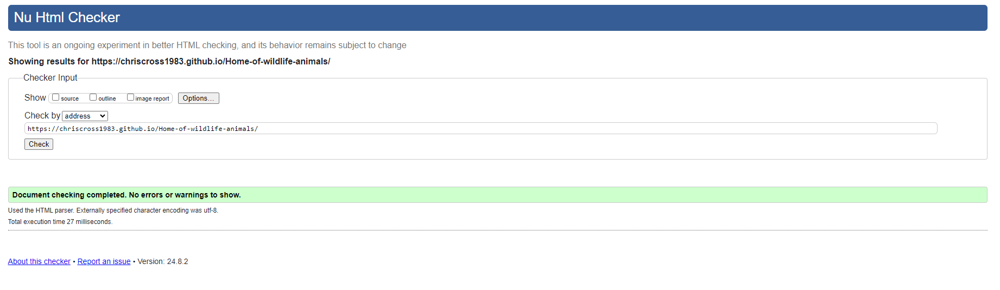

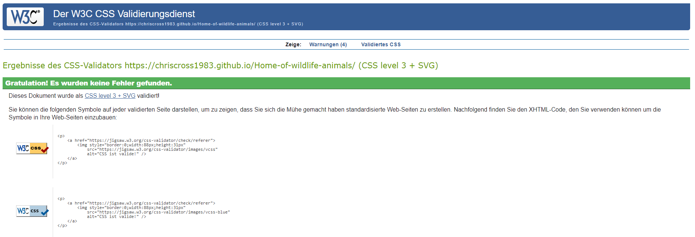

## Lighthouse Testing

The website was also put through Lighthouse testing via Chrome Devtools which tests a site under 4 different headings: Performance, Accessibility, Best Practices and SEO and it tests it under mobile and desktop criteria.

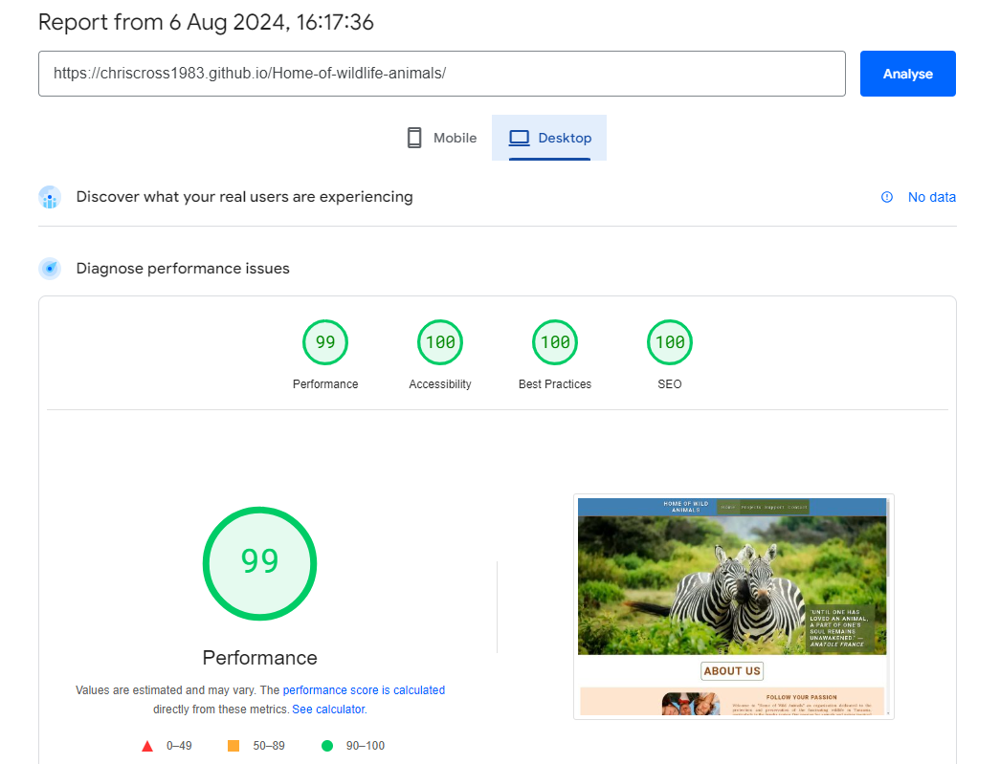

## Accessibility Testing

[A11y](https://color.a11y.com/) was used to check the colour contrast on the website for accessibility purposes which it passed.

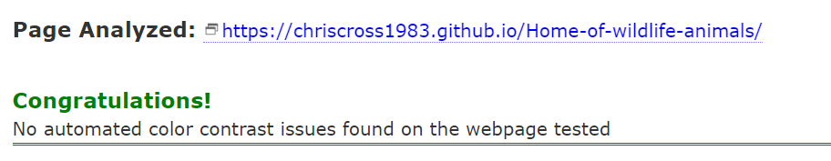

## Responsive Testing

Responsiveness was tested via a few different mediums manually, including Chrome Devtools, The [Viewport Resizer](https://chromewebstore.google.com/detail/viewport-resizer-ultimate/kapnjjcfcncngkadhpmijlkblpibdcgm?hl=en) chrome extension and [The Responsive Design Checker](https://responsivedesignchecker.com/) website.

## Manuel Testing / Testing User Stories TO DO!!

In addition to the automated process above, manual testing was carried out on the site as well.

* Naviagtion Menu

  - Verified that all the links link to the appropriate page with no broken links on all pages.
  - Verified that the logo when clicked links back to the Home Page.
  - Verified that the logo image has an alt text and fallback image for non browser support of the svg file.
  - Verified that the hover effects are consistent on all links.
  - Verified that the active page is highlighted.
  - Verified that the navigation bar is full responsive.

* Home Page

  - Verified that the Hero image is not pixelated and is fully responsive.
  - Verified that all images on the home page are optimised and have alt functions.
  - Verified that all the elements are fully responsive

* Projects Page

  - Verified that all the images are optimised and have alt texts.
  - Verified that all the elements are fully responsive.

* Support Page

  - Verfied all the images are optimised and have alt texts.
  - Verified that all elements are fully responsive.

* Contact Page

  - Verified that once the information is submitted via contact form, that the GET function works correctly and retrieves the thank you page.
  - Verified that the mailto function works correctly on the email link.
  - Verified that the page is fully responsive.

* Thank You Page

  - Verified that the thank you page is linked correctly to the contact form.
  - Verified that the Thank You Page is fully responsive.

* Footer

  - Verified that the email asset links properly with the mailto function.
  - Verified that the social media links are all linked properly to the releveant social media home pages.
  - Verified that all the social media links open in a new tab.

* Browser Testing

  - Love Light Photography has been manually tested in Google Chrome, Microsoft Edge, Mozilla Firefox and Safari on both desktop and mobile.
  - Verified that all images worked correctly
  - Verified that design and structure was consistent across all browsers.
  - Verfied responsiveness across all browsers.

# Bugs

  - Solved Bugs: What the bug was and how you solved it.
  - Known Bugs : What the bug is and why you decided to leave it.
  - Unfixed Bugs
    
  Include screenshots/gif of issue and any resources used to fix them

# Credits

## Content and Code
## Media
## Acknowledgements