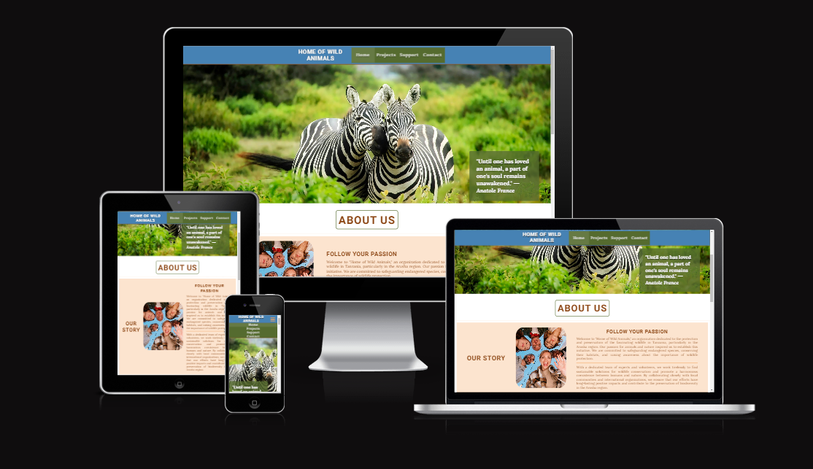
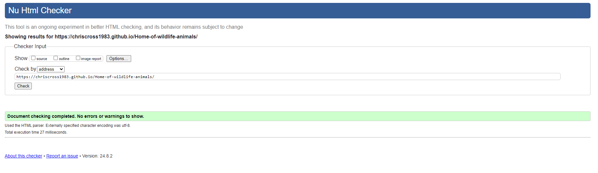
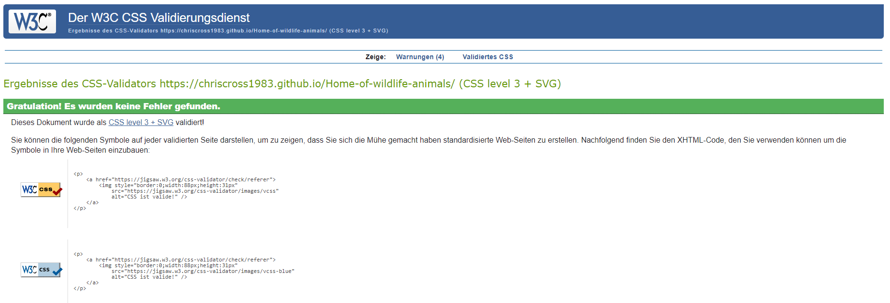

# Home of wildlife animals - Project portfolio 1 - HTML & CSS
  
Home of wild animals is a small NGO located in Tanzania that presents its work and the people behind it in a warm manner. 
The site is aimed at all individuals who are looking for a professional and reputable organization to help. Visiting the website builds trust by talking in detail about the motivation and daily projects of the organization.

You can explore the live site here - [Link to deployed site](https://chriscross1983.github.io/Home-of-wildlife-animals/)

## Objective

The aim of the website is to introduce the user to a friendly and profesional NGO, with the progressing desire to support the organisation by helping in person or donating.
## UX

### Target Audience

  - User who are looking for volunteering projects
  - User who have an affinity to animals, nature and travel topics 
  - User of any age (maybe limited for volunteering in person) and residing all over the world can activley support

### User Stories

  - A user should be able to determine the site's purpose immediately
  - A user should be able to easily and intuitively navigate the site
  - A user should be able to identify the content of each page easily
  - A user should feel comfortable contacting the business for more information or to book an package

### Site Aims

- To introduce the business to the user in a warm, friendly and inviting manner
- To provide the user with all the information needed to contact the business or to book an package for volunteering
- To offer a alternative but also simple way to support (donation), if the user doesn´t want to volunteer in person
- To offer a clear method to contact the business
- To provide information about the organisation members and their mission
- To supply a short overview of the main projects to work on together 
- To deliver a starting guide to the cost of volunteering

## Design
  - Color Scheme
  - Typography
  - Wireframes
  - Site Structure
  - Imagery used
  - Database structure(PP3, PP4, PP5)
  - Anything else you want to add that relates to UX/UI

## Features
  - Site Navigation
    - Feature name
    - A description about the feature and how it works
    - Screenshot image of the feature
  - Future Features

## Technologies Used
  - Languages used
  - Frameworks, libraries etc

## Deployment

### Project Deployment via GitHub
  
The Home of wildlife animals repository is stored on GitHub. The site was created using GitPod and the live site is hosted on GitHub Pages. This is a guide to deploy a site on GitHub Pages using GitHub.

    1. Sign in to GitHub and find the repository in the repositories menu.
    2. Click to open the repository and click on the settings icon to open the settings menu for the repository.
    3. In the settings menu, click on the pages tab on the left side of the screen.
    4. Under source, select branch:main, leave the folder on root and click save.

The page will then automatically refresh and provide a link to the published site when it has finished processing.

The live link can be found here - https://chriscross1983.github.io/Home-of-wildlife-animals/

## Testing
Home of wild animals has been validated via W3C HTML Validator and the W3C CSS Validator. There were 3 minor errors that came all up for the index.html page, where an error in relationship was detected. This was immediately corrected and documented down below in Bugs Fixed.

The website was also put through Lighthouse testing via Chrome Devtools which tests a site under 4 different headings: Performance, Accessibility, Best Practices and SEO and it tests it under mobile and desktop criteria.

- Accessibility Testing
  ### Manuel Testing / Testing User Stories

## Bugs
  - Solved Bugs: What the bug was and how you solved it.
  - Known Bugs : What the bug is and why you decided to leave it.
  - Unfixed Bugs
    
  Include screenshots/gif of issue and any resources used to fix them

## Credits
  ### Content and Code
  ### Media
  ### Acknowledgements