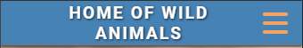
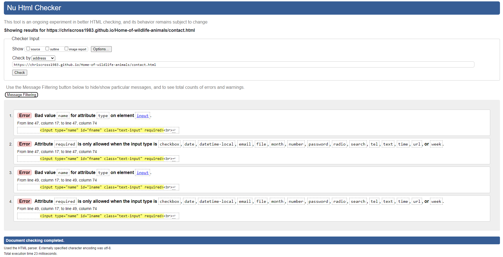

# Home of wildlife animals - Project portfolio 1 - HTML & CSS
  
Home of wild animals is a small NGO located in Tanzania that presents its work and the people behind it in a warm manner. 
The site is aimed at all individuals who are looking for a professional and reputable organization to help. Visiting the website builds trust by talking in detail about the motivation and daily projects of the organization.

You can explore the live site here - [Link to deployed site](https://chriscross1983.github.io/Home-of-wildlife-animals/)

# Objective

The aim of the website is to introduce the user to a friendly and profesional NGO, with the progressing desire to support the organisation by helping in person or donating.

# UX

## Target Audience

  - User interested in volunteering projects
  - User who have an affinity for animals, nature and travel topics 
  - User of any age (maybe limited for volunteering in person due to physical effort) or gender and residing all over the world can activley support

## User Stories

  - A user should be able to determine the site's purpose immediately
  - A user should be able to easily and intuitively navigate the site
  - A user should be able to identify the content of each page easily
  - A user should feel comfortable contacting the NGO for more information, donate a  certain ammount or register for voluntary work

## Site Aims

- To introduce the organisation in a warm, friendly and inviting manner
- To provide the user with all the information needed to contact the business or to register for voluntary work
- To offer a alternative but also simple way to support (donation), if the user doesn´t want to volunteer in person
- To provide information about the organisation members and their mission
- To supply a short overview of the main projects to work on together 
- To deliver and explain two easy to understand options of supporting the organisation
- To offer a clear method to contact the business by an form

# Design

## Color Scheme
The main idea of building the color scheme was to visualize a warm atmosphere that fits the African culture. The navigation bar features a calming shade of blue for confidence and stability. The main text is represented by an earthy tone of African savannahs and landscapes. The sections in the body are seperated by a smooth white line and the used color creates a welcoming and calming atmosphere. The footer symbolized by and green hue symbolizes the vegetation of african bush and dschungles. To ensure good contrast and accessibility, some text areas are written in white. This choice was made because the main color scheme does not have combinations that pass the contrast test.

## Typography

Two types of fonts were chosen for this website: "Roboto" and "Lora". The choice of these fonts enhances both readability and aesthetic appel. Roboto, with its clean and modern design, was used for the headings and action buttons. Lora adds a touch of classic refinement to the body text and the menu bar. For better readability and depth, the logo, menu bar and contact form are highlighted by a text shadow. Togehter, these fonts create a harmonious balance between modernity and tradition, perfectly complementing the warm and natural color scheme oft the website.

## Wireframes

The design and structure for this website was created with balsamiq. The designs produced were low fidelity wireframes for desktop, tablet and mobile version. The final designs and structure differ from the wireframes due to developments during the construction of the website.

 Low Fidelity Wireframes 

## Site Structure

Home of wild animals consists of a 5-page website with 4 pages that the user can navigate between via the navigation bar. The  page is the default loading page. The Logo is on the left side and is also linked to the Home Page. On the right-hand site of the logo are four navigation links: [Home](index.html), [Projects](projects.html), [Support](support.html) and [Contact](contact.html). The only hidden page is the ["Thank You" page](thankyou.html), which appears when the user completes and submits the form on the contact page. Until the screen size of 768px the user can navigate through a burger icon, which hides the navigation links for better visibility. When clicked, the menu bar opens straight down to the bottom of the logo and shows the available options to choose from.

# Features

## Navigation

* The navigation menu is featured at the top of the page and contains the links to main content.

* The logo is on the left in the navigation bar and is clickable and links back to the homepage.

* There are four variations of the navigation bar for different screen sizes.

* For a good user experience the design and color style of the menu bar are simple and consistent.

* The current page where the user is located is visualized with a static brighter hue. Additionally, for a better user experience, the brightness of the menu link changes when hovered over, providing a clear indication ot the actionable item.

## Home Page

* The Home Page is the landing page of the website and the first impression the user will see. It is designed to warmly welcome the user and quickly find out the purpose of the website.

* Initially, there is a large hero image featuring two zebras, accompanied by an emotional quote that aligns with the ethos by which the NGO stands by (this kind of large background image you will find on all sites, the quote also on the projects and support sites) - the chosen styles and hues harmonize with each other and represent a natural atmosphere.

* Followed by a large "About us" header, this section showcases and describes the members behind the organsiation, immediatley building trust with the visitor.

* The same sized "Our Mission" header introduces the section that provides a detailed background on three main fields of voluntary work, giving the user a tangible understanding of the daily operations of an NGO.

* Nearly at the bottom of the page there is a small section that helps the user follow a logical flow and easily navigate to the next page without needing to scroll back to the top.

* Each section is fully responsive, with the multiple column content naturally transitioning into single column content. For better readibility,the headings also scale up with larger screen views.

 Mobile Home Page 

## Projects Page

* The projects page is the second page, reachable from its link of the navigation bar or as described above from the previous page at the bottom section.

* The page lists the focus projects in an ordered way categorized in sepearate sections for animals, nature and people.

* The goal of this page is to transparently describe the different projects areas, provide a better understanding of the practical work as a volunteer, and increase interest in choosing a favorite project the user feels connected to. 

* The different color transparencies of the sections and small white borders between and surronding the body of the page make it easy for the user to visually understand when a new topic starts.

* Nearly at the bottom of the page there is again a small section that helps the user follow a logical flow and easily navigate to the next page (or to the previous) without needing to scroll back to the top.

* Each section is fully responsive, with the multiple column content naturally transitioning into single column content. For better readibility,the headings also scale up with larger screen views.

 Mobile Projects Page 

## Support Page

* Thesupport page is the third page, reachable from its link of the navigation bar or as already described from the bottom section of each site.

* The page describes the two ways a user can support the organization, including an easy-to-process "call to action" button for each section. The first button, "I want to help" redirects to the contact page of the website for further steps, while the "I want to donate" button links to an external site (www.paypal.com) to facilitate a donation.

* The goal of this page is to build trust by giving the organization a personal character and explaining why support is a necessary part of ensuring the sustainability and survival of the NGO.

* The different color transparencies of the sections and small white borders between and surronding the body of the page make it easy for the user to visually understand when a new topic starts.

* Nearly at the bottom of the page there is again a small section that helps the user follow a logical flow and easily navigate to the next page (or to the previous) without needing to scroll back to the top.

* Each section is fully responsive, with the multiple column content naturally transitioning into single column content. For better readibility, headings, buttons and text also scale up with larger screen view.

 Mobile Support Page 

## Contact Page

* The contact page is last visible page on the website, the goal is to turn the users gained interest into a communication request by using the form.

* The contact form is kept simple and reflects some of the mentioned topics from the previous pages, such as the project areas (animals, humans, nature).

* The design is consitent with the layout of the quote, feauturing three input fields; First Name, Last Name and Email Address. There is also an radio button field with three options; Animals, Nature and People, along with two select fields to choose one of four possible answers for the offered time periods in the categories; Quater and Year.

* The required attribute prevents the user from submitting an incorrect form and ensures that all necessary input fields are filled out.

* The form uses a GET function to link to a Thank You page, mimicking the effect of actually submitting the form. This improves the users visual interaction by displaying a personal message.

* The contact page is fully responsive, for better readibility, headings, buttons and text also scale up with larger screen view.

 Mobile Contact Page 

## Thank you Page

* The Thank You page cannot be accessed by the user from any links on the website. It can only be accessed by submitting the contact form on the Contact page which uses a GET function to retrieve the page to imitate the contact form submission.

* The style and design is still consistent, with the navigation bar on top and footer on the bottom, to allow the user to navigate back to the main website.

* The thank you page is fully responsive, for better readibility the text and an effect like position of the message field, change and scale up with larger screen view.

 Mobile Thank You Page 

## Footer

* The Footer contains the social media links.

* For better UX design, each of the social media links open in a new tab.

* The Facebook, Instagram and Youtube links are purely for the educational purposes of the website and only navigate to the home page of each of the sites.

* It also contains an email link which uses a mailto function to open the devices preferred email software. The email used is just a dummy email to show how the user interacts with the link.

[Back to top](<#home-of-wildlife-animals---project-portfolio-1---html--css>)

# Future Features

* News feed with the latest progress and challenges of the projects

* Gallery page for more impressions of the different projects and the working fields/headquarters of the organization

* A more detailed "About Us" section introducing the entire team with a short summary and picture of each member

* Implementation of an embedded and personalized donate button with direct payment options, allowing users to choose a fixed or variable amount, as well as regular donations through a subscription

* Sign-up area to become an official member of the NGO, automatically collecting the yearly association fee via PayPal or bank transfer

* Exclusive advantages for members, such as subscribing to a newsletter

# Technologies Used

### Languages used

* HTML5 - Delivers the structure and content for the website.
* CSS3 - Provides the styling for the website.

### Frameworks, Libraries & Programs Used

* [Balsamiq](https://balsamiq.com/) - Used to create wireframes for the website
* [Google Fonts](https://fonts.google.com/) - Used to import the 'Roboto' and 'Lora' fonts into the style.css file which are used on all pages of the project.
* [Font Awesome](https://fontawesome.com/) - Used to add icons for aesthetic and UX purposes.
* [Gitpod](https://www.gitpod.io/) - Used to develop the website.
* GitBash - Terminal used to push changes to the GitHub repository.
* [GitHub](https://github.com/) - Used as the respository for the projects code after being pushed from Git.
* [cloudconvert](https://cloudconvert.com/png-to-webp) - Used to convert and resize the images on the website.

# Deployment

## Project Deployment via GitHub
  
The Home of wildlife animals repository is stored on GitHub. The site was created using GitPod and the live site is hosted on GitHub Pages. This is a guide to deploy a site on GitHub Pages using GitHub.

    1. Sign in to GitHub and find the repository in the repositories menu.
    2. Click to open the repository and click on the settings icon to open the settings menu for the repository.
    3. In the settings menu, click on the pages tab on the left side of the screen.
    4. Under source, select branch:main, leave the folder on root and click save.

The page will then automatically refresh and provide a link to the published site when it has finished processing.

The live link can be found here - https://chriscross1983.github.io/Home-of-wildlife-animals/

# Testing

## Code Validation

Home of wild animals has been validated via W3C HTML Validator and the W3C CSS Validator. There were three minor errors categories coming up on different locations on the website, this was immediately corrected and documented down below in [Solved Bugs](<#bugs>).

## Lighthouse Testing

The website was also put through Lighthouse testing via Chrome Devtools which tests a site under 4 different headings: Performance, Accessibility, Best Practices and SEO and it tests it under mobile and desktop criteria.

## Accessibility Testing

[Experte.com](https://www.experte.com/accessibility/contrast) was used to check the colour contrast on the website for accessibility purposes which it passed.

## Responsive Testing

Responsiveness was tested via a few different mediums manually, including Chrome Devtools and the [Viewport Resizer](https://chromewebstore.google.com/detail/viewport-resizer-ultimate/kapnjjcfcncngkadhpmijlkblpibdcgm?hl=en) chrome extension.

 Screenshots Responsivness 

## Manuel Testing

In addition to the automated process above, manual testing was carried out on the site as well.

* Naviagtion Menu

  - Verified that all the links link to the appropriate page with no broken links on all pages.
  - Verified that the logo when clicked links back to the Home Page.
  - Verified that the hover effects are consistent on all links.
  - Verified that the active page is highlighted (also on each page of the website).
  - Verified that the navigation bar is full responsive.

* Home Page

  - Verified that the Hero image is not pixelated and is fully responsive.
  - Verified that all images on the home page are optimised and have alt functions.
  - Verified that all the elements are fully responsive

* Projects Page

  - Verified that all the images are optimised and have alt texts.
  - Verified that all the elements are fully responsive.

* Support Page

  - Verfied all the images are optimised and have alt texts.
  - Verified that all elements are fully responsive.

* Contact Page

  - Verified that once the information is submitted via contact form, that the GET function works correctly and retrieves the thank you page.
  - Verified that the mailto function works correctly on the email link.
  - Verified that the page is fully responsive.

* Thank You Page

  - Verified that the thank you page is linked correctly to the contact form.
  - Verified that the Thank You Page is fully responsive.

* Footer

  - Verified that the email asset links properly with the mailto function.
  - Verified that the social media links are all linked properly to the releveant social media home pages.
  - Verified that all the social media links open in a new tab.

* Browser Testing

  - Love Light Photography has been manually tested in Google Chrome, Microsoft Edge, Mozilla Firefox on both desktop and mobile.
  - Verified that all images worked correctly
  - Verified that design and structure was consistent across all browsers.
  - Verfied responsiveness across all browsers.

[Back to top](<#home-of-wildlife-animals---project-portfolio-1---html--css>)

# Bugs

## Solved Bugs

### HTML Validation

The following errors was presented once the website was placed through W3C HTML Validator.

It said that the "a" element must not appear as a descendant ot the "button" element. I removed the button element and add the class selector for creating a button within the a element, it cleared that error up.

It said that some type attribute had a bad value "name" and regarding this issue it was not allowed to use the "required" attribute in the input elements. I changed the wrong value from name to "text" and it cleared that error up.

It said that the a section lack heading was found.  deleted the section due to the unused id selector "filler" and it cleared that error up.

It said that there is a "empty" form label found in the header regarding thenav toggle bar. Becaus there is not text intended I add an aria-hidden="true" to the i element and copy / paste it to all the other html sites, it cleared that error up. 
  
### Lighthouse Testing

Due to the first Lighthouse report, I struggled with the "mobile perfomance" and tried to find some help online. I found this site [web.dev](https://web.dev/articles/optimize-lcp?hl=de), which helped me fix this issue.

  1. First I converted the format of all images to webp and resize them using the tool [cloudconvert](https://cloudconvert.com/png-to-webp).
  2. Then, I moved the "Google Import Fonts" from the style.css file to the HTML file.
  3. I also added the attribute loading="lazy" to all body images, so they load only when the user scrolls to them.
  4. Finally, I added the attribute "async" to the script element for the FontAwesome navigation bar icon, to speed up the website by loading the fonts in parallel with the rest of the site.

These changes raise the perfomance to at least a value of 80.

# Credits

* Fonts were sourced from [Google Fonts](https://fonts.google.com/)
* All images from the website were sourced from [Pexels](https://pexels.com/) and [Unsplash](https://unsplash.com/)
* Images were compressed by [cloudconvert](https://cloudconvert.com/)
* Colour palette was created by [coolors.co](https://coolors.co/)
* Flexbox system was learned via [w3schools.com](https://www.w3schools.com/) and the [Flexbox Froggy Game](https://flexboxfroggy.com/)
* Fix perfomance issue was inspired by [web.dev](https://web.dev/articles/optimize-lcp?hl=de)

## Code

* This project incorporates code from the following source:

  - Love Running: Creating a navigation toggle that hides and disappear on mobile screens due to the smaler space, were adapted from this project.

I would like to thank the original authors for their work and contributions, which have been instrumental part in the development of this project.

# Acknowledgements

This site, Home of Wild Animals was designed and developed in conjunction with the Full Stack Software Developer Diploma course at the Code Institute. I would like to thank my mentor, my cohort facilitator, my classmates of our cohort, the Slack community and of course Code Institute for all their input and support.

[Back to top](<#home-of-wildlife-animals---project-portfolio-1---html--css>)